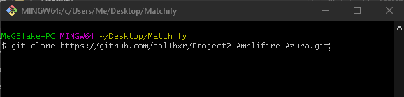

# Project2-Amplifire-Azura

## Project Description
Matchify is a website where users can login into their music streaming account, register an account with our application, and access their personal information. They can also find other user’s accounts and see their top artists. They can then favorite those users in their own favorites list.

## Technologies Used:  
  Java, Spring Framework, Angular 10, Spring Data, Spring Boot, Git, PostgreSQL, JUnit, AWS EC2, AWS RDS, Jenkins

## Features:  
  Account Registration  
  Login/ Logout  
  Ability to view personal information and update it  
  Access a streaming service API to see information about their top songs, artists and genres  
  Ability to see other people's profiles  
  Aility to add other users to a favorite users list  
  Ability to remove previously added favorite users from their account  

**Possible future developement features:**  
Song recommendation service  
More information about songs and artists displayed from the API

## Setting up the application:

**Clone the repository somewhere onto your computer with git**  

**Import an existing Maven project into your IDE**  

**Select the folder into which you cloned the repository**  

**Run the Main class as a Spring Boot application**  

**Navigate to <the file you cloned into/Angular/matchify> and open a terminal. Then, run the command "ng serve -o"**  

## Usage

To use any features, login with Spotify! You can then navigate throughout the application using the nav bar at the top or the links on the home page. Thanks for checking out our project!  
**Samples:**  

